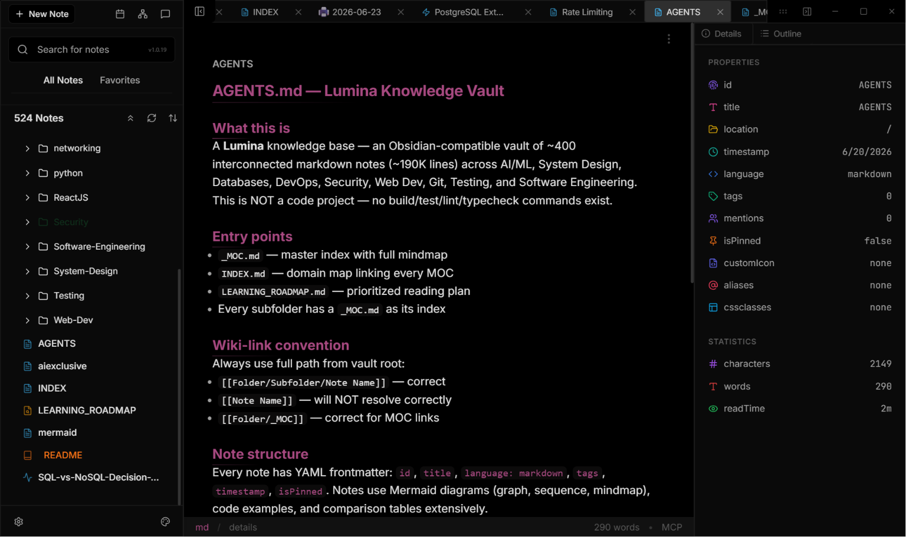

# lumina



<p align="center">
  
  
  
</p>

lumina is a note-taking desktop app where everything is plain markdown on disk. features a multi-tab workspace, knowledge graph, ai semantic search (local + cloud), 18 themes, and a codemirror 6 editor with wikilinks, mermaid diagrams, callouts, and live preview.

---

## features

### core

- **vault-first** — all notes are plain `.md` files with yaml frontmatter. you own your data.
- **multi-tab workspace** — open many notes at once with pinned tabs, drag reorder, dirty indicators
- **live preview** — wysiwym editing with intelligent syntax hiding
- **wikilinks** — `[[link]]` and `[[link|display]]` with auto-update on rename
- **knowledge graph** — interactive force-directed graph visualisation of note connections
- **ai semantic search** — local embeddings via onnx (privacy-first) or cloud providers
- **daily notes** — one-click journal creation with auto-date
- **multi-vault** — switch between vault directories

### editor

- **codemirror 6** — advanced text editor with 100+ language syntax highlighting
- **mermaid diagrams** — render ```` ```mermaid ```` blocks inline
- **callouts** — `> [!note]`, `> [!warning]`, `> [!tip]` etc.
- **wikilinks** — autocomplete, preview, bidirectional linking
- **image paste** — drag-and-drop images, auto-saved to `.lumina/assets/`
- **auto-save** — debounced write to disk on every change
- **caret persistence** — remembers cursor position per file

### ai

- **multi-model** — deepseek (v3 / r1), openai (gpt-4o), anthropic (claude), ollama (local)
- **chat panel + modal** — sidebar chat or floating modal overlay
- **composer with slash commands** — `/fast`, `/think`, `/creative`, `/code`, `/image`, `/clear`
- **rag context** — optional semantic search over your vault as context for every query
- **image generation** — huggingface inference api
- **local embeddings** — `all-minilm-l6-v2` via @xenova/transformers in a web worker

### ui

- **18 themes** — dark, light, high-contrast, nature-inspired palettes
- **glassmorphism** — mirror mode with backdrop blur and translucency
- **resizable sidebars** — left explorer + right panels, fully configurable
- **command palette** — `ctrl/cmd+p` for instant feature access
- **keyboard-first** — comprehensive shortcuts (customisable)
- **tab management** — pin, reorder, close to right, close others

### search

- **full-text** — fast keyword search via flexsearch
- **semantic** — vector similarity search over your entire vault
- **tags** — visual tag pills with autocomplete
- **file explorer** — familiar tree view with folder colours

---

## getting started

### prerequisites

- node.js 18+ (lts)
- npm
- git

### install

```bash
git clone https://github.com/Saboor-Hamedi/lumina.git
cd lumina
npm install
```

### dev

```bash
npm run dev
```

### build

```bash
npm run build:win    # windows
npm run build:mac    # macOS
npm run build:linux  # linux
```

---

## usage

### create a note

`ctrl/cmd + n` → start typing → auto-saves.

### link notes

```markdown
this references [[another note]] and [[yet another note|display text]].
```

renaming a note auto-updates all `[[links]]` across the vault.

### use the ai

- `ctrl/cmd + k` — open inline ai
- click the ai icon in the right sidebar — full chat panel
- type `/` in the composer — slash commands

### graph view

click the graph icon in the activity bar. nodes are notes, edges are wikilinks. drag to explore, click to navigate.

---

## development

### project structure

```
lumina/
├── src/
│   ├── main/                    # electron main process
│   │   ├── index.js             # main entry point
│   │   ├── vaultmanager.js      # file i/o, chokidar watcher
│   │   ├── vaultindexer.js      # onnx semantic indexing
│   │   ├── vaultsearch.js       # cosine similarity search
│   │   └── settingsmanager.js   # settings persistence
│   ├── preload/                 # preload bridge (ipc)
│   │   └── index.js
│   └── renderer/                # react application
│       └── src/
│           ├── core/
│           │   └── store/       # zustand stores
│           │       ├── usevaultstore.js
│           │       ├── usesettingsstore.js
│           │       └── useaistore.js
│           ├── features/
│           │   ├── ai/          # chat panel, composer, providers, worker
│           │   ├── workspace/   # codemirror editor + extensions
│           │   ├── explorer/    # file tree
│           │   ├── graph/       # knowledge graph
│           │   ├── settings/    # settings modal
│           │   └── overlays/    # modals, command palette
│           └── components/      # shared ui components
├── brain/                       # project documentation
│   ├── introduction.md
│   ├── features/                # feature deep-dives
│   └── vault/                   # vault system docs
└── scripts/
```

### scripts

```bash
npm run dev              # dev server with hmr
npm run build            # build current platform
npm test                 # tests (watch)
npm run test:run         # tests once
npm run test:coverage    # coverage report
npm run lint             # eslint
npm run format           # prettier
```

### tech stack

**main process:**
electron 39.2.4 · chokidar 5 · gray-matter 4 · better-sqlite3 (legacy)

**renderer:**
react 19.1.1 · codemirror 6 · zustand 5 · dexie 4 · marked 17 · highlight.js 11 · lucide-react · @xenova/transformers 2 · react-force-graph-2d · flexsearch

**build:**
vite 7 · electron-vite · vitest · tailwindcss 3 · electron-builder 26

---

## testing

93 tests across 8 files covering components, stores, hooks, utils, and main process modules.

```bash
npm test                    # watch mode
npm run test:run            # single run
npm run test:coverage       # with coverage
npm test -- --grep "button" # specific pattern
```

---

## documentation

the `brain/` directory contains comprehensive project docs for agents and developers:

| path | covers |
|------|--------|
| `brain/introduction.md` | entry point, table of contents |
| `brain/features/01-architecture.md` | full system architecture (main, preload, renderer, cm6, ipc, themes, export) |
| `brain/features/02-ai.md` | ai system (store, providers, worker, chat, composer, image gen) |
| `brain/vault/01-overview.md` | vault system (manager, indexer, search, store, data flows) |
| `brain/features/03-testing.md` | testing guide (commands, coverage, mock patterns, ci/cd) |
| `brain/features/04-roadmap.md` | project roadmap and planned features |
| `brain/features/05-devnotes.md` | active dev notes and architecture decisions |

---

## contributing

1. fork the repo
2. `git checkout -b feature/amazing-feature`
3. make changes
4. `npm test`
5. commit (`git commit -m 'add amazing feature'`)
6. push → open a pr

---

## license

mit — see [license.md](./license.md)

---

## acknowledgments

- [electron](https://www.electronjs.org/)
- [react](https://react.dev/)
- [codemirror](https://codemirror.net/)
- [lucide](https://lucide.dev/)
