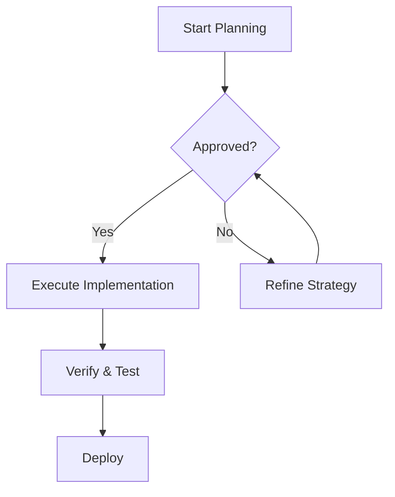
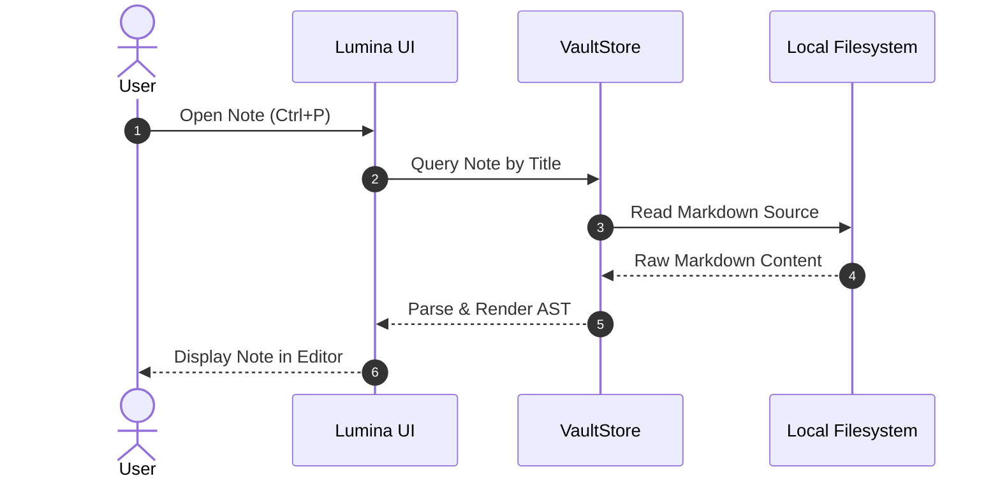
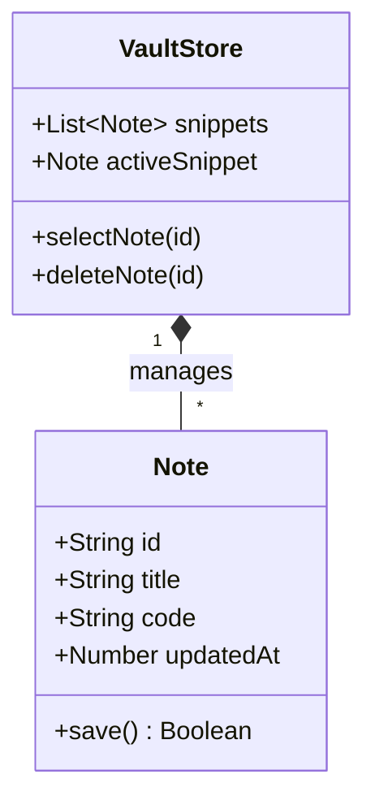
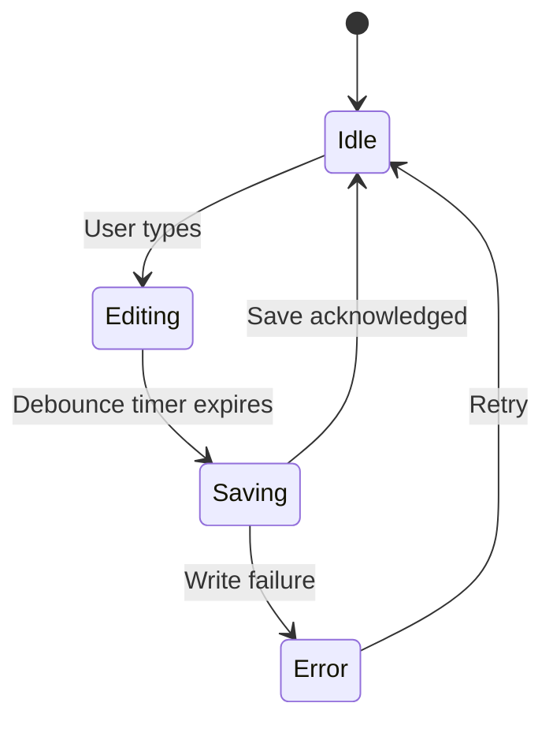
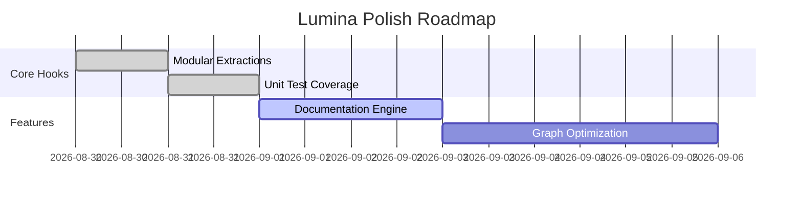
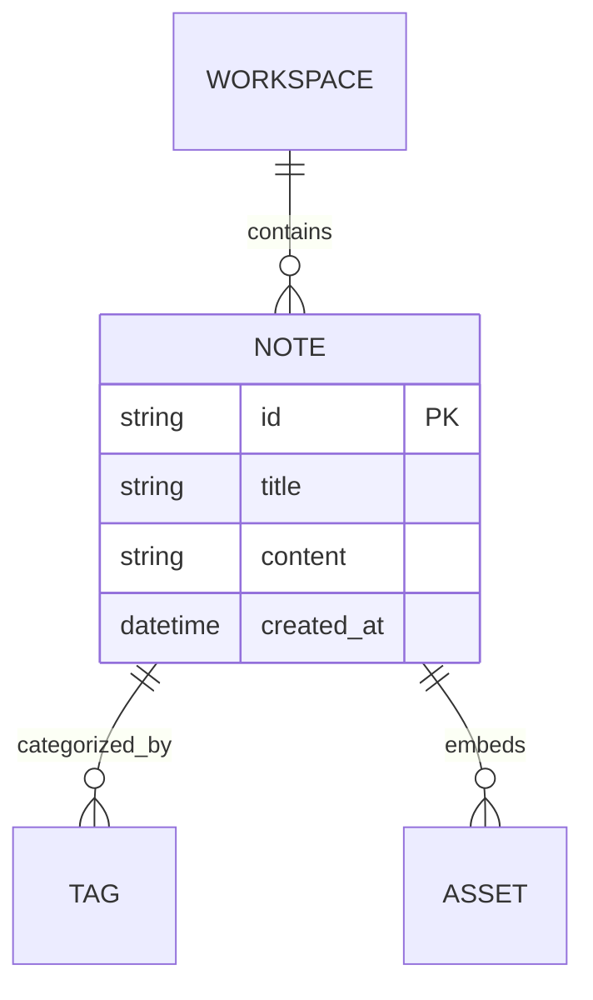

# Mermaid Diagrams

Lumina embeds a native Mermaid engine that renders text-defined diagrams directly into high-fidelity SVG graphics.

---

## Flowcharts

Create flowcharts with `graph TD` (top-down) or `graph LR` (left-to-right):

````markdown

````

### Node Shapes
- `[Rectangle]`
- `(Rounded Rectangle)`
- `([Pill Shape])`
- `[[Subroutine]]`
- `[(Database)]`
- `((Circle))`
- `>Asymmetric Flag]`
- `{Rhombus / Decision}`

---

## Sequence Diagrams

````markdown

````

---

## Class Diagrams

````markdown

````

---

## State Diagrams

````markdown

````

---

## Gantt Charts

````markdown

````

---

## Entity Relationship Diagrams (ERD)

````markdown

````
