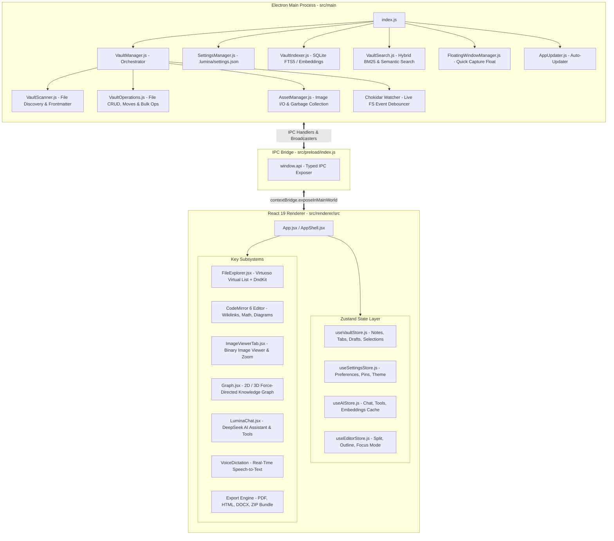

# Lumina — Complete Architecture & Feature Catalog

> **Target Audience**: AI Agents & Developers working on the Lumina codebase.
> **Last Updated**: 2026-09-03
> **Core Stack**: Electron 39, React 19, Vite 7, Zustand 5, CodeMirror 6, Dnd-Kit, Better-SQLite3, Gray-Matter, Chokidar, Three.js.

---

## 1. System Architecture & High-Level Flow

Lumina is a local-first markdown thinking environment and personal knowledge management (PKM) tool. It eliminates proprietary database lock-in: every note is a human-readable `.md` file with YAML frontmatter, and all media files are stored directly inside the vault directory.

---

## 2. Complete Catalog of Features in Lumina

### 1. File Explorer & Vault Organization (`src/renderer/src/features/Explorer/`)
- **60fps Virtualization**: Powered by `react-virtuoso` (`Virtuoso`) to render 10,000+ files and folders without lag.
- **Dnd-Kit Drag & Drop**:
  - Reordering notes within lists.
  - Moving notes into folders (with hover auto-expansion).
  - Nesting folders inside other folders.
  - Moving items back to the vault root.
  - Multi-item dragging (drag all selected notes at once).
- **Inline Top-of-List Creation**: Creating a note or folder opens the input field right at the **top** of the active folder or root level.
- **Multi-Selection**: `Ctrl+Click` / `Cmd+Click` and `Shift+Click` range selection for batch operations (bulk delete, bulk move, bulk tagging).
- **Starred / Favorites**: One-click star icon to favorite notes and folders, rendered with gold indicator icons.
- **Custom Icons & Color Tagging**:
  - Lucide Icon Picker with search for assigning custom icons to any note or folder.
  - Color palette picker for color-coding notes and folders.
- **Vault Stats Popover**: Real-time stats calculating total notes, total images, folders, favorites, word count, character count, text size, and binary media storage size.
- **External Drag & Drop Import**: Drag files and folders directly from Windows Explorer / macOS Finder into Lumina to import them with automatic duplicate renaming (`Name (1).md`).

---

### 2. Dual-Mode Markdown Editor (`src/renderer/src/features/Editor/`)
- **CodeMirror 6 Engine**: High-performance editor with instant keystroke response.
- **Slash Commands (`/` trigger)**:
  - Headings 1, 2, 3
  - Bulleted List, Numbered List, Task Checklist
  - Code Block with Language Selector
  - Interactive Table
  - Callouts / Admonitions (Note, Tip, Warning, Danger, Info)
  - Mermaid Diagram
  - LaTeX Math Equation
  - Date / Time Stamp
- **Interactive Markdown Tables (`table/`)**:
  - Visual column and row addition/deletion.
  - Keyboard navigation across cells (`Tab`, `Shift+Tab`, `Enter`).
  - Clean markdown table alignment formatting.
- **Rich Code Blocks (`codeBlock/`)**:
  - Language selector with syntax highlighting for 50+ languages.
  - One-click copy code button.
  - Line numbers and syntax theme sync.
- **Live Wikilinks (`[[Note Name]]`)**:
  - Autocomplete popup when typing `[[`.
  - Click to navigate directly to linked notes.
  - Broken wikilink indicator styling.
  - Backlinks counter and linked mentions detector.
- **Mathematical Equations (KaTeX)**: Inline `$math$` and block `$$display$$` formula rendering.
- **Interactive Mermaid Diagrams**: Live rendering of flowcharts, sequence diagrams, state diagrams, class diagrams, and entity-relationship models.
- **Outline & Table of Contents**: Automatically generated live heading outline in the right sidebar.
- **Split View**: Side-by-side comparative note editing.
- **Focus & Zen Mode**: Typewriter scrolling, dimming unfocused paragraphs, and distraction-free full-screen writing.
- **Daily Notes (`DailyNotes.jsx`)**: Calendar widget with automatic `YYYY-MM-DD.md` creation for daily journaling.

---

### 3. First-Class Image & Media Management (`Workspace/`, `dropImage/`)
- **Native Binary Support**: Supported formats: `.png`, `.jpg`, `.jpeg`, `.webp`, `.gif`, `.svg`, `.bmp`, `.ico`, `.avif`.
- **Dedicated Image Viewer Tab (`ImageViewerTab.jsx`)**:
  - Smooth pan and zoom from 10% to 500% with mouse wheel and drag controls.
  - Natural image dimensions readout and size formatting.
  - One-click **Copy Image to Clipboard** (writes native PNG to system clipboard).
  - Open in OS Explorer button.
- **Universal Image Safety Guard**: Absolute interceptor ensuring image files are NEVER converted to `.md` or overwritten with markdown frontmatter when edited, renamed, or styled.
- **Tab Migration on Rename/Move**: Renaming or dragging an image automatically updates open workspace tabs from the old path hash ID to the new ID without blank screens.
- **Orphaned Asset Garbage Collector**: Background scanning that safely purges unreferenced images from `.lumina/assets/`.

---

### 4. 2D & 3D Knowledge Graph (`src/renderer/src/features/Graph/`)
- **2D Knowledge Graph**: Interactive force-directed canvas (`react-force-graph-2d`).
- **3D Knowledge Graph**: Full WebGL 3D knowledge universe (`react-force-graph-3d`, `three.js`, `three-spritetext`).
- **Semantic & Wikilink Links**: Visualizes both explicit `[[wikilinks]]` and AI semantic similarity links.
- **Graph Controls**: Sliders for link distance, node repulsion force, collision radius, and centering.
- **Filters**: Toggle to hide orphan notes, hide tag nodes, or hide ghost uncreated notes.
- **Physics Optimization**: Media assets and images are excluded from physics calculations to guarantee 60fps graph simulation.

---

### 5. AI Assistant & Thinking Environment (`src/renderer/src/features/AI/`)
- **LuminaChat Assistant (`LuminaChat.jsx`)**:
  - DeepSeek and OpenAI/Anthropic API integration.
  - Streaming responses with step-by-step reasoning tokens.
  - Contextual awareness of active note and selected text.
- **Agentic File Tools**:
  - `createFile({ title, code, folderId })`: Creates a new note in the vault.
  - `updateFile({ id, code })`: Modifies an existing note.
  - `appendToFile({ id, text })`: Appends text to a note.
  - `moveFile({ id, targetFolderId })`: Moves a note to a new directory.
  - `clearFile({ id })`: Empties note content.
  - `renameFile({ id, newTitle })`: Renames note cleanly.
- **Local Embeddings & Semantic Search**:
  - Hugging Face `@xenova/transformers` running locally.
  - SQLite vector embeddings cache for semantic search and graph links.

---

### 6. Voice Dictation (`src/renderer/src/features/VoiceDictation/`)
- Real-time speech-to-text dictation using the Web Speech API.
- Live microphone waveform indicator.
- Dictated sentences stream directly into the active editor cursor position.

---

### 7. Search & Command Palette (`src/main/VaultSearch.js`, `Overlays/`)
- **Global Command Palette (`Ctrl/Cmd+K` / `Ctrl/Cmd+P`)**: Fast launcher for notes, commands, settings, and navigation.
- **Full-Text Search (SQLite FTS5 + BM25 Ranking)**: High-speed lexical search with highlighted matches.
- **Hybrid Semantic Search**: Combines BM25 keyword matching with vector cosine similarity.

---

### 8. Export & Publishing Engine (`src/main/handlers/`, `src/export/`)
- **Markdown Bundle (`.zip`)**: Exports vault or selected notes packaged with all referenced image assets in a zip file.
- **Clean Self-Contained HTML**: Exports notes to standalone HTML with embedded styles.
- **PDF Document**: Generates styled PDFs with headers, footers, page breaks, and custom margins.
- **Microsoft Word (`.docx`)**: Converts markdown to native `.docx` documents.
- **Plain Text (`.txt`)**: Strips markdown formatting for clean text export.

---

### 9. Backup & Google Drive Synchronization (`src/main/backup/`)
- **OAuth2 Google Authentication**: Secure login via Google Identity Services.
- **Google Drive Vault Backup**: One-click encrypted snapshot backup of the vault to Google Drive with progress tracking.

---

### 10. System & Window Management (`src/main/`)
- **Floating Mini-Window (`FloatingWindowManager.js`)**: Quick-capture notepad that stays on top of all system windows (`Ctrl/Cmd+Shift+N`).
- **System Tray Integration (`useTrayIcon.js`)**: Runs in the background with a system tray menu, minimize-to-tray, and auto-start on boot.
- **Auto-Updater (`AppUpdater.js`)**: Checks GitHub releases for app updates, downloads in background, and installs seamlessly.

---

## 3. Main Process Architecture (`src/main/`)

| File | Purpose | Key Responsibilities |
| :--- | :--- | :--- |
| **`VaultManager.js`** | Facade & Orchestrator | Active vault path, debounced Chokidar watcher (50ms), window event broadcasting (`vault:updated`), `init()` startup. |
| **`VaultScanner.js`** | Discovery & Normalization | Recursive traversal of `.md` and images, `safeParseFrontmatter`, ID healing, MD5 image hashing, strict type coercion. |
| **`VaultOperations.js`** | Disk Mutator & Safety | Frontmatter serialization, universal image safety guard, native moves, bulk delete, folder operations, external path import. |
| **`AssetManager.js`** | Media Management | Saving to `.lumina/assets/`, base64 dataUrl extraction, orphan asset garbage collection. |
| **`SettingsManager.js`** | Preferences Store | Manages `.lumina/settings.json`, automatic directory creation prior to write. |
| **`VaultIndexer.js`** | Search Engine | SQLite FTS5 database management, document indexing, embeddings calculation. |
| **`VaultSearch.js`** | Hybrid Search | BM25 text search combined with vector semantic similarity rankings. |

---

## 4. Frontend State Layer (Zustand Stores)

| Store | File | Core Responsibilities |
| :--- | :--- | :--- |
| **`useVaultStore`** | `useVaultStore.js` | Note & Image list (`snippets`), folders list, active tabs (`openTabs`), `activeTabId`, `selectedSnippet`, `drafts`, multi-selection IDs (`selectedNoteIds`, `selectedFolderIds`), `loadVault()`, `saveSnippet()`, `deleteSnippet()`. |
| **`useSettingsStore`** | `useSettingsStore.js` | User settings (`theme`, `fontSize`, `lineNumbers`, `vimMode`, `folderOrder`, `pinnedFolders`). |
| **`useAIStore`** | `useAIStore.js` | Conversation history, provider selection, streaming tokens, embeddings cache. |
| **`useEditorStore`** | `useEditorStore.js` | Split view, outline state, focus mode, typewriter mode. |

---

## 5. IPC Channel Reference (`preload` <-> `main`)

| Channel | Direction | Payload | Description |
| :--- | :--- | :--- | :--- |
| `vault:getSnippets` | Renderer -> Main | None | Returns `{ snippets, folders }` |
| `vault:saveSnippet` | Renderer -> Main | `snippet` | Saves `.md` file (guarded against images) |
| `vault:saveImage` | Renderer -> Main | `{ buffer, name }` | Writes binary image to `.lumina/assets/` |
| `vault:readAsset` | Renderer -> Main | `relativePath` | Returns `{ buffer, base64, dataUrl, mimeType }` |
| `vault:deleteAsset` | Renderer -> Main | `relativePath` | Deletes image file on disk |
| `vault:deleteSnippet` | Renderer -> Main | `id` | Deletes note or image by ID |
| `vault:moveFile` | Renderer -> Main | `oldRelPath, newRelPath` | Natively renames/relocates file on disk |
| `vault:bulkDelete` | Renderer -> Main | `{ folderIds, snippetIds }` | Deletes multiple folders/notes atomically |
| `vault:createFolder` | Renderer -> Main | `path` | Creates directory on disk |
| `vault:renameFolder` | Renderer -> Main | `oldPath, newPath` | Renames directory on disk |
| `vault:deleteFolder` | Renderer -> Main | `path` | Recursively deletes folder |
| `vault:importExternalPaths` | Renderer -> Main | `{ sourcePaths, targetFolderId }` | Imports external files/folders |
| `vault:cleanOrphans` | Renderer -> Main | None | Purges unused image assets |
| `vault:updated` | Main -> Renderer | None | Broadcast event when disk changes occur |
| `db:getSetting` / `db:saveSetting` | Renderer -> Main | `key, value` | Reads/writes `.lumina/settings.json` |

---

## 6. Critical Invariants for Developers & AI Agents

> [!CAUTION]
> **Strict Rules for Modifying Lumina**:
> 1. **No Code Comments Rule**: Never add code comments in created or modified components, hooks, or backend modules.
> 2. **Universal Image Safety**: Never serialize frontmatter or rename files to `.md` on items with `type === 'image'`.
> 3. **Frontmatter Type Safety**: Booleans (`isPinned`, `isLearned`) must always be evaluated strictly (`=== true || === 'true'`).
> 4. **File Structure Integrity**: Pure JS in `.js` files, JSX strictly in `.jsx` files.
> 5. **Vault Auto-Rescan**: Any backend operation modifying folders or files on disk MUST trigger `await this.scanVault()` and `this.notifyWindows('vault:updated')`.
> 6. **Graph Physics Isolation**: Never pass binary images or media nodes into graph force simulations.
