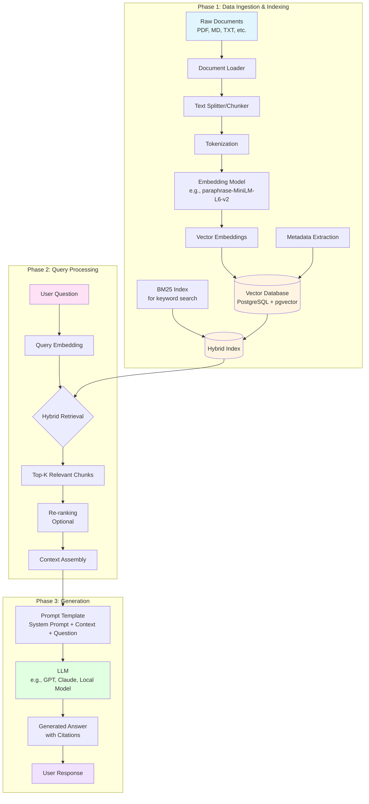

## What is RAG?

**RAG (Retrieval-Augmented Generation)** is an AI architecture that combines two powerful components:

1. **Retrieval System**: Searches through your knowledge base to find relevant information
2. **Generation Model**: Uses a Large Language Model (LLM) to generate responses based on the retrieved information

Think of it as giving an LLM access to a library. Instead of relying solely on what it learned during training, it can look up current, specific information before answering.

### Why RAG Matters:
- **Reduces hallucinations**: Grounds answers in actual data
- **Keeps information current**: No need to retrain the model for new data
- **Domain-specific**: Works with your private documents and databases
- **Transparent**: You can see which sources were used

---

## The RAG Process Flow

Here's a comprehensive Mermaid diagram showing the complete RAG pipeline:



---

## Detailed Breakdown of Each Stage

### 1. **Data Ingestion Pipeline**


```
Raw Documents → Chunking → Tokenization → Embedding → Storage
```

- **Document Loading**: Parse various formats (PDF, Markdown, TXT, DOCX)
- **Text Splitting**: Break documents into manageable chunks (e.g., 500-1000 tokens)
  - Overlap between chunks to maintain context
  - Respect semantic boundaries (paragraphs, sections)
- **Tokenization**: Convert text into tokens the embedding model understands
- **Embedding**: Transform text chunks into dense vector representations (e.g., 384-dimensional vectors)
- **Storage**: Save vectors in a vector database with metadata (source, page, timestamp)

### 2. **Indexing Strategies**

Based on your setup with PostgreSQL:
- **Vector Index (pgvector)**: For semantic similarity search using cosine similarity
- **BM25 Index**: For keyword-based retrieval (handles exact matches well)
- **Hybrid Approach**: Combines both for better recall and precision

### 3. **Query Time Flow**

from buttom it jumps here ->


```
User Question → Embed Query → Retrieve → Rank → Generate
```

1. **Embed the query** using the same embedding model
2. **Retrieve** top-K most similar chunks from vector DB
3. **Re-rank** results (optional but improves quality)
4. **Assemble context** by concatenating retrieved chunks
5. **Generate answer** using LLM with prompt template

### 4. **Prompt Template Structure**


```
System: You are a helpful assistant. Answer based on the provided context.

Context:
- [Chunk 1 from document A]
- [Chunk 2 from document B]
- [Chunk 3 from document C]

Question: {user_question}

Answer:
```

---

## Key Technologies You're Using

Based on your memory:
- **Embeddings**: `paraphrase-MiniLM-L6-v2` (excellent for semantic search)
- **Database**: PostgreSQL with **pgvector** extension
- **Retrieval**: Hybrid approach with **BM25** + **semantic search**
- **Backend**: Python with FastAPI integration
- **Application**: Integrated into **Kmanager** desktop app

This setup gives you robust, accurate search across your 11,000+ data entries while maintaining the lightweight, one-result-at-a-time interaction pattern you prefer!
